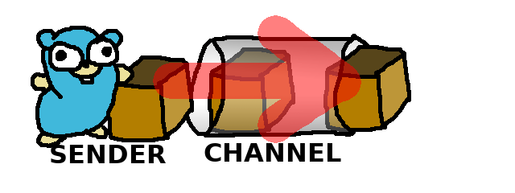

# Go channels basics
In this repository I'll try to explan how go channels work and how they can be used for solving complex concurrency problems.

## What is a go channel?
A go channel is a type of object used communicate between concurrent processes without having to deal with the complexity cost that comes with that kind of systems. Go channels work like a pipe that can be used to share data, a process sends some data through a channel and some other process can consume it.


## What problems does it solve?
When dealing with concurrency, having shared state is generally a bad idea. Multiple things are happening at once and there is no control over the order of excecution of instructions. Managing shared state often requires complex algorithms which may lead to common problems such as deadlocks and data races. Data flows in many directions, reading and writing operations happen simultaneously and as a result the application may end up in an invalid or corrupt state.


## How does it work?
Go channels solve most these problems simply by controlling the way data flows. Generally when using channels, data flows in a single direction. This prevents processes interfering with each other and protects the state of the application. Instead of every process sharing global state, they communicate through channels sending and recieving data. Some adjustments in the architecture have to be done in order to implement channels, the program has to be split into sections of workers that are responsible of doing different things and send data to the next worker through a channel, similar to the way Henry Ford revolutionized production. Each worker specializes on doing something different and if there's a need to increase speed, more instances of workers can be added.


## Quick start
Clone the repository with the following command:
```shell
git clone https://github.com/TritiumMonoid/go-channels-basics.git
```

Inside the `src` directory there is a file called `main.go`. This file simulates some concurrent processes and logs each step to get a better idea of the way go channels work. It takes three arguments to run:
1. Amount of sender goroutines (default 0).
2. Amount of consumer goroutines (default 0).
3. Channel buffer size (optional).

Run the file with the folling command:
```shell
go run main.go $SENDERS_AMOUNT $CONSUMERS_AMOUNT $BUFFER_SIZE
```

Example:
```shell
# 1 sender, 1 consumer, buffer size 5
go run main.go 1 1 5
```
Output:
```
A sending 1...
A sending 2...
A sending 3...
A sending 4...
A sending 5...
A sending 6...
B waiting for data... 
B recieved 1
B processing 1...
A sending 7...
B waiting for data... 
B recieved 2
B processing 2...
A sending 8...
B waiting for data... 
B recieved 3
B processing 3...
A sending 9...
B waiting for data... 
B recieved 4
B processing 4...
A sending 10...
B waiting for data... 
B recieved 5
B processing 5...
B waiting for data... 
B recieved 6
B processing 6...
B waiting for data... 
B recieved 7
B processing 7...
B waiting for data... 
B recieved 8
B processing 8...
B waiting for data... 
B recieved 9
B processing 9...
B waiting for data... 
B recieved 10
B processing 10...
B waiting for data... 
Done!
```

### Sending data to a channel
Many goroutines can send data simultaneously to the same channel. If there's no consumer they block unless the channel has a buffer.

#### Single sender
##### No consumer, No buffer
It locks because there's nobody to consume the data, nor isn't a buffer to store the data.

##### No consumer, Buffer
It sends data to the channel until the buffer is full, then it locks.


#### Multiple senders
##### No consumer, No buffer
They lock because there's nobody to consume the data, nor isn't a buffer to store the data.

##### No consumer, Buffer
They send data to the channel until the buffer is full, then they lock.


### Consuming data from a channel
Many goroutines can recieve data simultaneusly from the same channel. As long as there's data in the channel they consume it. If there's no data in the channel they block until there's data to consume.

